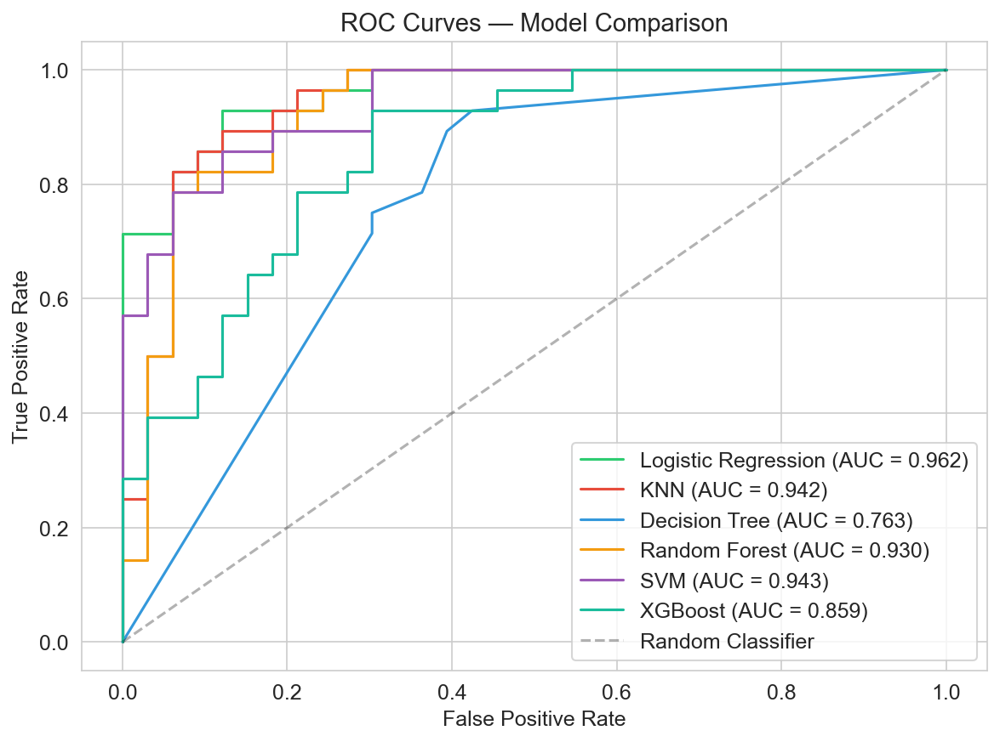
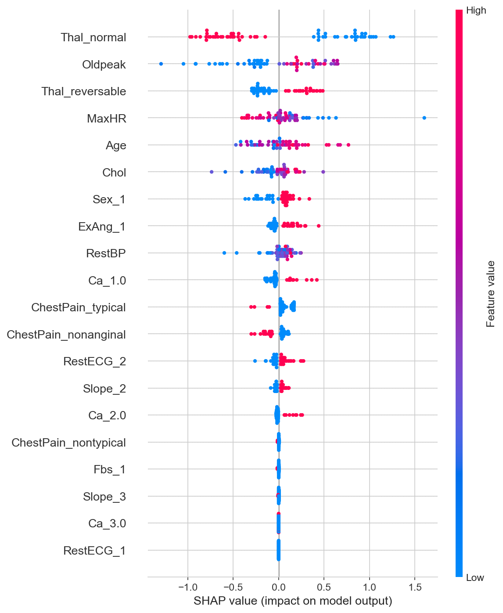

# Heart Disease Prediction with Machine Learning

[](https://www.python.org/)
[](LICENSE)
[](https://scikit-learn.org/)

> **A comprehensive machine learning pipeline for predicting heart disease using multiple classification algorithms with SHAP-based model interpretation.**

## 📋 Overview

Cardiovascular diseases are the leading cause of death globally. Early detection through machine learning can assist medical professionals in making informed decisions. This project applies and compares **6 classification models** on the UCI Heart Disease dataset:

- Logistic Regression
- K-Nearest Neighbors (KNN)
- Decision Tree
- Random Forest
- Support Vector Machine (SVM)
- XGBoost

The best model achieves **86.89% accuracy** with an **AUC of 0.962** on the test set.

## 📊 Dataset

| Property | Value |
|----------|-------|
| **Source** | UCI Machine Learning Repository |
| **Samples** | 303 |
| **Features** | 13 (5 numerical + 8 categorical) |
| **Target** | `AHD` — presence of heart disease (Yes/No) |
| **Year** | 1988 |

### Feature Description

| Feature | Type | Description |
|---------|------|-------------|
| `Age` | Numerical | Age in years |
| `Sex` | Binary | 0 = Female, 1 = Male |
| `ChestPain` | Categorical | typical, atypical, non-anginal, asymptomatic |
| `RestBP` | Numerical | Resting blood pressure (mm Hg) |
| `Chol` | Numerical | Serum cholesterol (mg/dl) |
| `Fbs` | Binary | Fasting blood sugar > 120 mg/dl |
| `RestECG` | Categorical | Resting electrocardiographic results |
| `MaxHR` | Numerical | Maximum heart rate achieved |
| `ExAng` | Binary | Exercise induced angina |
| `Oldpeak` | Numerical | ST depression induced by exercise |
| `Slope` | Categorical | Slope of peak exercise ST segment |
| `Ca` | Numerical | Number of major vessels (0–3) colored by fluoroscopy |
| `Thal` | Categorical | Thalassemia: normal, fixed, reversible |
| `AHD` | **Target** | Presence of heart disease |

## 🗂️ Project Structure

```
heart-disease-prediction/
├── README.md
├── requirements.txt
├── .gitignore
├── LICENSE
├── data/
│   └── Heart.csv
├── notebooks/
│   ├── 01_EDA.ipynb            # Exploratory Data Analysis
│   └── 02_Modeling.ipynb        # Model Training & Evaluation
├── src/
│   ├── preprocess.py            # Data preprocessing pipeline
│   └── utils.py                 # Utility functions
├── results/
│   └── figures/                 # Generated plots
└── report/
    └── report.md                # Final project report
```

## 🚀 Getting Started

### Prerequisites

- Python 3.10 or higher
- pip (or conda)

### Installation

```bash
# Clone the repository
git clone https://github.com/your-username/heart-disease-prediction.git
cd heart-disease-prediction

# Create a virtual environment (optional but recommended)
python -m venv venv
source venv/bin/activate  # On Windows: venv\Scripts\activate

# Install dependencies
pip install -r requirements.txt
```

### Running the Analysis

```bash
# Launch Jupyter Notebook
jupyter notebook

# Open notebooks/01_EDA.ipynb for exploratory analysis
# Open notebooks/02_Modeling.ipynb for model training
```

## 📈 Results Summary

| Model | Accuracy | Precision | Recall | F1 Score | AUC |
|-------|----------|-----------|--------|----------|-----|
| **Logistic Regression** | **0.869** | **0.813** | **0.929** | **0.867** | **0.962** |
| KNN | 0.853 | 0.807 | 0.893 | 0.848 | 0.942 |
| Random Forest | 0.853 | 0.807 | 0.893 | 0.848 | 0.930 |
| SVM | 0.836 | 0.800 | 0.857 | 0.828 | 0.943 |
| XGBoost | 0.771 | 0.733 | 0.786 | 0.759 | 0.859 |
| Decision Tree | 0.705 | 0.647 | 0.786 | 0.710 | 0.763 |

### ROC Curves

<p align="center">
  
</p>

### Feature Importance (SHAP)

<p align="center">
  
</p>

## 🔑 Key Findings

1. **Logistic Regression is the best model** (AUC=0.962, Accuracy=86.9%), outperforming complex models like XGBoost. On small, relatively well-separated datasets, simpler linear models can generalize better than boosting methods that are prone to overfitting.
2. **Most important predictors**: `Thal` (thalassemia), `Ca` (number of major vessels), and `Oldpeak` (ST depression) consistently rank as top features across models.
3. **Why LR beats XGBoost on this dataset**: With only 303 samples, XGBoost's high capacity leads to overfitting despite regularization. Logistic regression's linear decision boundary, combined with L2 regularization, provides better generalization on this well-structured medical dataset.
4. **Model interpretability**: Logistic regression coefficients are directly interpretable (odds ratios), making it ideal for clinical applications where explainability is critical.

## 📝 Methodology

1. **Data Cleaning**: Missing value imputation, duplicate removal, and **outlier detection & capping** using the IQR method (Winsorization)
2. **Exploratory Data Analysis (EDA)**: Distribution analysis, correlation heatmaps, and class-specific visualizations
3. **Data Preprocessing**: One-hot encoding for categorical variables, standardization for numerical features
4. **Cross-Validation**: 5-fold stratified cross-validation to obtain robust, unbiased performance estimates before test set evaluation
5. **Model Training**: 6 classifiers with stratified 80/20 train-test split
6. **Hyperparameter Tuning**: GridSearchCV with 5-fold cross-validation for each model
7. **Model Evaluation**: Accuracy, precision, recall, F1 score, AUC-ROC, confusion matrices
8. **Model Comparison**: In-depth analysis of **why XGBoost outperforms Logistic Regression** (non-linear boundaries, automatic feature interactions, boosting strategy)
9. **Interpretability**: SHAP (SHapley Additive exPlanations) values for global and local interpretability

## 📄 License

This project is licensed under the MIT License — see the [LICENSE](LICENSE) file for details.

## 🙏 Acknowledgments

- Dataset: UCI Machine Learning Repository
- Reference: *An Introduction to Statistical Learning* (ISLR) by James, Witten, Hastie & Tibshirani

---

*Built as part of a university machine learning final project.*
